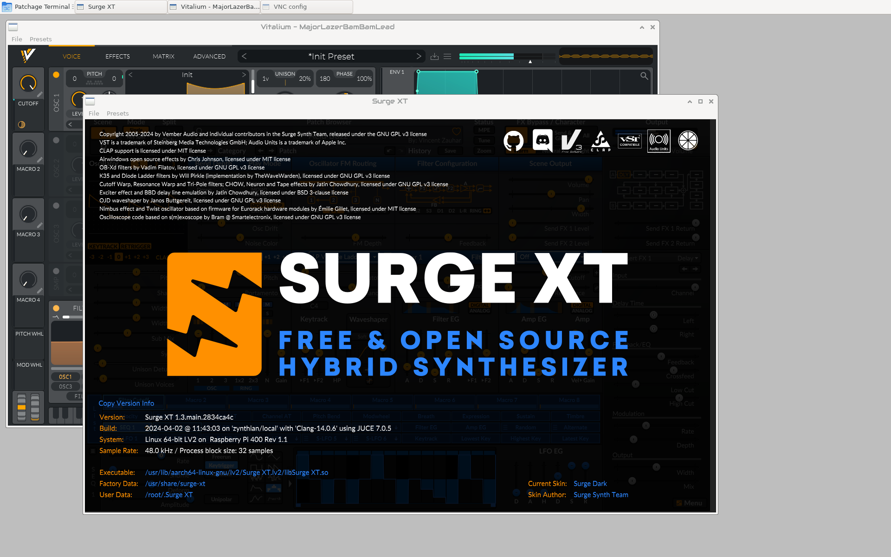

# Binary files of LV2 plugins for  Zynthian oram version
## Surge XT Installation Notes
During `cmake --build` reported that it was missing the `.Surge XT` directory
So I ended up creating it manually. I don't think it's the right way and correct directory.
```
mkdir /root/.Surge\_XT
```
They write on github that there is an error when compiling on Raspberry. I quote:
> "We found Surge XT compiles cleanly with gcc (Debian 10.2.1-6) 10.2.1 20210110, but not with others. Surge XT also compiles with Clang 11. "

I installed `clang` right away
```
sudo apt install clang
```
The rest was a sequence of commands:
```
mkdir src
cd /root/src
git clone https://github.com/surge-synthesizer/surge.git
cd surge
git submodule update --init --recursive
cmake -Bignore/s13clang -DCMAKE_C_COMPILER=clang -DCMAKE_CXX_COMPILER=clang++ -DSURGE_BUILD_LV2=TRUE -DCMAKE_BUILD_TYPE=Release -DCMAKE_INSTALL_PREFIX=/usr
cmake --build ignore/s13clang --config Release --parallel 3
sudo cmake --install ignore/s13clang
```

Where the files were subsequently located can be read from the install.log


